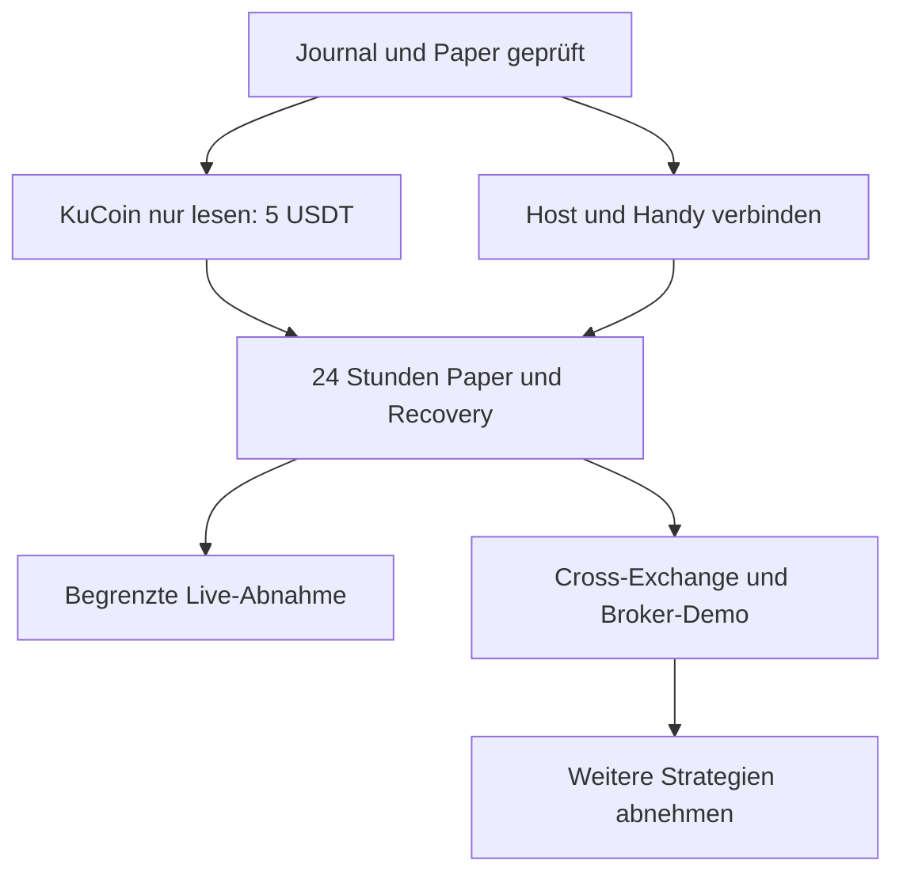

# JIN Trading Roadmap

Stand: **7. Oktober 2026** · [PR #2](https://github.com/jino101/hummingbot/pull/2)
· Arbeitszweig `feat/jin-trading-control`.
Ziel: 5 echte USDT auf KuCoin, mehrere Bots, gemeinsame 10%-Tagesverlust-Stopregel,
Bedienung am Galaxy S24; später Cross-Exchange, Aktien und Forex.
**100 USDT im Standardbeispiel sind virtuelles Paper-Kapital.**

„Implementiert“ bezeichnet geprüften Code. Eine externe Abnahme erfordert den
benannten Konto-/Betriebstest und ist damit noch nicht automatisch bestanden.

## Implementierung und verbleibende Abnahmen

| ID | Stand | Ergebnis und nächste Abnahme |
|---|---|---|
| R01 | Implementiert; Kontoabnahme offen | Aktive Stop-Actions, dauerhafte Client-IDs, Füllmengen, unbekannte Orders, Cancel/Abgleich, manuelle Restbestandsannahme. Reale Cancel-Bestätigung und späte Börsenfills prüfen. |
| R02 | Implementiert; Kontoabnahme offen | Globale reale Equity, Bestandsbewertung, Reservierung und Tages-Latch. Mehrere Bots auf einem Konto zählen Equity einmal. Konten-/Cashflow-Abnahme durchführen. |
| R03 | Implementiert; Soak offen | Echte Hummingbot-Tracker-Zeitstempel, Sequenz-/Reconnect-Schutz und erneute Frischeprüfung vor Order. Börsen-Datenalter 24 Stunden messen. |
| R04 | Implementiert | Frische Bitget-Quote-Umrechnung, voneinander getrennte Anbieter, Gebühren pro Leg/Flat Fees. Fehlende Transfergebühren gelten als unbekannt. |
| R05 | Teilweise; Live-Cross gesperrt | Authentifizierte Spot-/Berechtigungsadapter für alle drei Börsen vorhanden. Tokenidentität, Transferminimum, Empfangsdaten, Memo und Rückweg noch strikt belegen. Keine automatischen Transfers. |
| R06 | Werkzeug fertig; Konto fehlt | Nur lesender 5-USDT-Check. Verfügbare KuCoin-Bestände, persönliche Gebühren und drei Mindestorders mit lokalen Schlüsseln dokumentieren; Ergebnis darf „keine handelbare Route“ sein. |
| R07 | Implementiert; Soak offen | Dynamische WebSocket-Kataloge, begrenzte Rotation, Deduplizierung und Reconnect. Reale Abdeckung, Wiederbesuchszeit, Last und Datenalter messen. |
| R08 | Implementiert und privat veröffentlicht | Sites-Oberfläche nutzt denselben Status, Risiko und Orderabgleich; keine Browser-Wallet. Noch keinen erreichbaren eigenen Bot-Host verbunden; Galaxy-Abnahme offen. |
| R09 | Implementiert | Latch bleibt nach abgewiesenem Start/Reset gespeichert; sichere IDs, Beobachtungsprüfung, vollständige CSV, atomare Log-/Snapshot-Schreiber. |
| R10 | Externe Entscheidung offen | Kleinen Linux-VPS oder passende ständig laufende Replit-Deployment-Art wählen. Kosten, Region, API-Erreichbarkeit und dauerhafte Daten prüfen; noch kein Host bestellt. |
| R11 | Teilweise | Docker-Neustart, Liveness, lokale Health-Prüfung sowie Online-Backup/Restore implementiert. HTTPS/VPN, unabhängiger Alarm, Restore auf Zielhost, zwei Geräte und signierte optionale Android-Release fehlen. |
| R12 | Implementiert; Live-Abnahme offen | Drei Leg-IOC mit vollständigem Preflight, tatsächlichen Fills, Gebühren und Recovery. Separater lokaler Live-Dienst, Standard bleibt Paper. Reale Kontoausführung nicht getestet. |
| R13 | Teilweise; Implementierung offen | Vorfinanzierte Cross-Exchange-Ausführungs-API mit gemeinsamer Reservierung getestet. Automatische Cross-Bot-Konfiguration, Identitätsprüfung, Inventarausgleich und native Executor-Anbindung fehlen; Echtgeld blockiert. |
| R14 | Externe Abnahme offen | Broker-/Börsen-Demo, Netzwerkunterbrechung, Restart/Cancel und danach ausdrücklich begrenzte Live-Abnahme mit lokal verbundenem Konto. |
| R15 | Implementiert | Stufen 5/10/25/50/100/250/500/1.000; absolute Budgets wachsen, Prozentgrenzen bleiben. Ein-/Auszahlungen sind nicht als Cashflow bereinigt. |
| R16 | Teilweise | Paper-Momentum, Grid, Mean Reversion mit gemeinsamen Grenzen; parallele Ausführung möglich. Strategien je Markt mit Kosten/Slippage prüfen; echtes Market-Making und deren Live-Freigabe fehlen. |
| R17 | Teilweise; Implementierung offen | Alpaca-Paper- und OANDA-Practice-Transporte samt Client-IDs/festen Demo-Hosts vorhanden. Brokerwahl, Demo-Journal, USD/FX, Handelskalender, Lots und vollständige Daten-/Order-Abnahme fehlen. |
| R18 | Messung offen | Noch kein realer Latenz-/Last-/Kostenbeleg. Kein institutionelles HFT oder zugesicherter Gewinn. |

## Konkrete nächste Aufgaben

1. **P0: KuCoin-Readonly-Abnahme (R06).** Zugangsdaten lokal mit erlaubten Rechten
   verbinden, verfügbares Kapital und Gebühren festhalten, ausführbare Dreiecke mit
   höchstens 2,5 USDT Einsatz nachweisen. Kein Ergebnis erzwingen.
2. **P0: Eigenen Host verbinden (R10/R11).** HTTPS oder privates VPN, dauerhafte
   SQLite-Datei, Autostart und unabhängige Zustandsüberwachung; Smartphone verbindet
   die bestehende Site. Entwicklungs-Vorschau reicht nicht als 24/7-Beleg.
3. **P0: 24-Stunden-Paper-Abnahme (R01–R03/R07/R11).** Zwei Clients, Not-Aus,
   API-Ausfall, Neustart und Restore dokumentieren. Keine Doppelorder, keine
   freigegebene unbekannte Exposition, identischer Zustand auf beiden Geräten.
4. **P1: Cross-Exchange vervollständigen (R05/R13).** Identität und vorfinanzierte
   Bestände strikt prüfen; beide Leg-Größen reservieren, Wiederherstellung und
   nötigen Inventarausgleich dokumentieren; bestehende native Instanz migrieren.
5. **P1: Aktien-/Forex-Demo vervollständigen (R17).** Broker und Markt auswählen;
   getrennte Demo-Datenbank, Währungsbewertung, Kalender/Lots und normalisierte
   Order-/Fill-Ereignisse in denselben Supervisor integrieren und abnehmen.
6. **P1: Begrenzte Live-Abnahme (R12/R14).** Erst nach erfolgreichem Mindestkapital-
   und Recovery-Test lokal aktivieren. Drei Legs, Fees, Restbestand, Cancel und
   Neustart auf dem tatsächlichen Konto dokumentieren.
7. **P2: Strategien und Latenz (R16/R18).** Kostenbereinigte Paper-Auswertung,
   Walk-forward-Tests, Lastmessungen und Betriebsbudget; daraus Freigaben ableiten.

## Plugins und Aufgaben

| Werkzeug | Nutzung / Stand |
|---|---|
| GitHub | Bestehender Code zusammengeführt, Entwurfs-PR aktualisiert, native und Paper-CI. Repository-Issues sind deaktiviert; Arbeitsliste hier und im PR. |
| Context7 | Aktuelle Hummingbot-/CCXT-Schnittstellen abgeglichen; SDK 4.5.85 festgelegt. |
| Composio | GitHub-Werkzeuge gefunden; Verbindung gesondert autorisieren. Direkte GitHub-Verbindung funktioniert bereits. |
| Sites | Bestehende private Bot-Zentrale veröffentlicht, gemeinsamer API-Status, Orderjournal und Restbestandsannahme. |
| Replit | Alternative App/Hosting-Vorbereitung für denselben GitHub-Code; Status im Gespräch prüfen. Noch kein 24/7-Host abgenommen. |
| Template Creator | Wiederverwendbare Vorlage der mobilen Bot-Zentrale; keine Kontoschlüssel oder Site-Identität übernehmen. |
| Pets | Codex-Begleiter ausgewählt. |
| Aufgabe erstellen | Bestehende Aufgabe „JIN Roadmap prüfen“ weiterverwenden; keine zweite Erinnerung anlegen. |

[Anleitung und konkrete Start-/Prüfschritte](README.md).
Zugangsdaten nicht in Chat, GitHub oder Frontend eintragen. Offene Kontoverbindungen
und Betriebsabnahmen sind keine durchgeführten Echtgeldtests.
